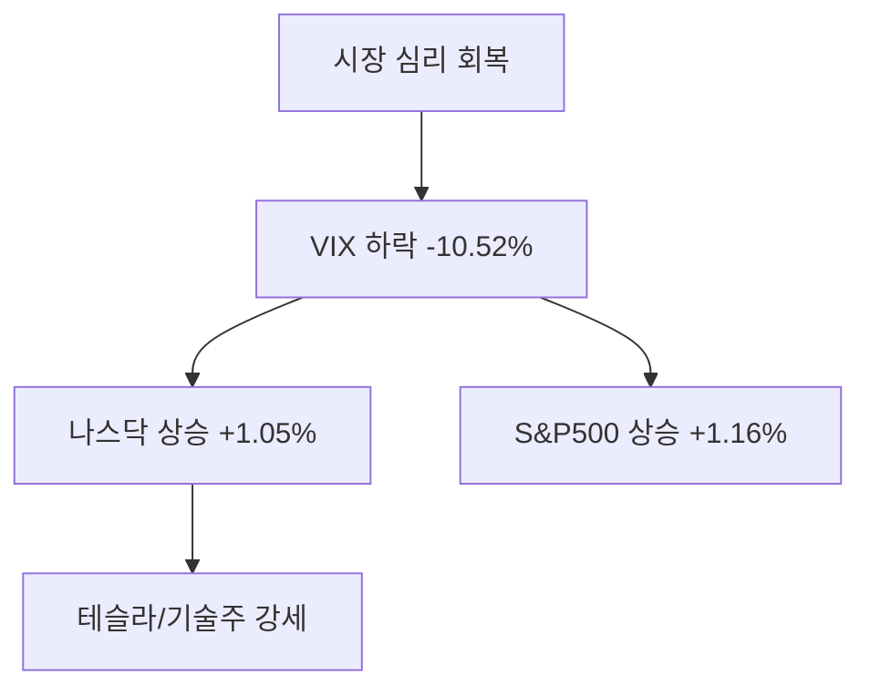

미국 증시가 3대 지수 모두 1% 이상의 견고한 상승세를 기록하며 마감했습니다. 특히 공포지수(VIX)가 10.52% 급락하며 시장 전반에 강력한 위험자산 선호 심리가 확산되고 있습니다.

## 1. 시장 핵심 요약

최근 7일간 뉴욕 증시는 기술주 중심의 나스닥과 대형주 중심의 S&P500이 동반 상승하며 긍정적인 흐름을 보였습니다. 테슬라와 스페이스X를 둘러싼 긍정적인 모멘텀이 하이테크 부문의 매수세를 견인한 것으로 분석됩니다.

### 시장 변동성 완화
공포지수가 19.48포인트까지 내려앉으며 시장의 불안감이 크게 해소되었습니다. 이는 투자자들이 고금리 유지 우려보다는 기업의 실적 성장에 더 큰 비중을 두고 있음을 시사합니다.

### 테슬라와 스페이스X의 시너지
테슬라의 자율주행(FSD) 기술 진보와 스페이스X의 스타링크 사업 확장은 일론 머스크의 비즈니스 생태계 전반에 대한 신뢰도를 높이고 있습니다. 특히 우주 산업의 상업적 가치가 부각되며 관련 공급망 기업들까지 수혜를 입고 있습니다.

## 2. 주요 지표 분석

| 지수 명칭 | 현재 지수 | 등락률 (7일) | 비고 |
| :--- | :--- | :--- | :--- |
| **다우존스** | 49,693.84 | +1.61% | 우량주 중심 완만한 상승 |
| **S&P500** | 6,877.15 | +1.16% | 시장 전반의 강세 반영 |
| **나스닥** | 22,777.83 | +1.05% | 기술주 매수세 지속 |
| **공포지수(VIX)** | 19.48 | -10.52% | 투자 심리 급격한 회복 |

### 주요 지수 등락 추이 (Visual)

## 3. 투자자 관전 포인트

### 테슬라의 펀더멘털 강화
테슬라는 전기차 시장 점유율 방어와 더불어 AI 및 로보틱스 분야에서의 가시적인 성과를 보여주고 있습니다. 스페이스X의 저궤도 위성 통신 기술이 향후 커넥티드 카 서비스에 통합될 가능성도 장기적인 투자 포인트입니다.

### 스페이스X의 비상장 가치와 IPO 기대감
스페이스X는 비상장 기업임에도 불구하고 시장 가치가 지속적으로 재평가받고 있습니다. 스타링크의 부분적 IPO 가능성이 제기될 때마다 테슬라를 포함한 머스크 관련 자산들의 변동성이 확대되는 경향이 있으니 주의가 필요합니다.

### 리스크 관리 전략
지수가 단기 급등한 만큼 차익 실현 매물이 출회될 가능성이 있습니다. VIX 지수가 낮아진 시점일수록 예기치 못한 매크로 지표(물가, 고용) 발표에 따른 변동성에 대비한 분할 매수 관점이 유효합니다.

## 4. 주요 뉴스 및 참고 자료
- [Tesla's AI and FSD Evolution: What to Watch](https://www.bloomberg.com)
- [SpaceX Valuation Hits New Heights in Secondary Market](https://www.reuters.com)
 

<strong>[안내 및 면책 조항]</strong> 
본 콘텐츠는 인공지능(AI) 모델을 활용하여 시장 데이터를 기반으로 자동 생성되었습니다. 
특정 종목에 대한 투자 권유가 아니며, 데이터의 지연이나 오류가 발생할 수 있습니다. 
투자에 대한 모든 책임은 투자자 본인에게 있습니다. 
내용에 오류가 있거나 저작권 문제가 발생할 경우, 관리자에게 문의하시면 즉시 삭제 또는 수정 조치하겠습니다.

