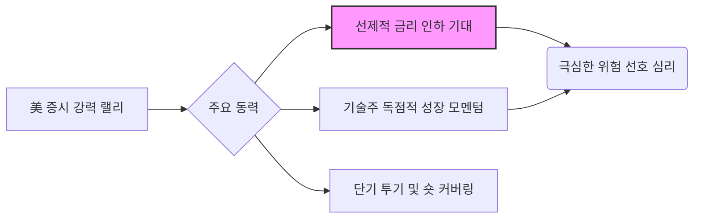

## 📌 시장 현황 보고: 미국 증시

### 1. Market Pulse: 지수 및 변동성 분석

최근 7일간 미국 증시는 강력한 상승 흐름을 보이며 연말 랠리 기대감을 높였습니다. 특히 VIX(공포지수)의 급락은 투자자들의 위험 선호 심리가 극도로 높아졌음을 시사합니다.

| 지수 | 종가 | 7일 변동률 | 시장 해석 |
|---|---|---|---|
| 다우존스 | 50,115.67 | **+2.47%** | 경기 방어적 성격에도 견고한 상승 |
| S&P 500 | 6,932.30 | **+1.97%** | 광범위한 상승세, 대형주 중심 강세 지속 |
| 나스닥 종합 | 23,031.21 | **+2.18%** | 기술주의 펀더멘털 모멘텀 유지 |
| 공포지수 (VIX) | 20.37 | **-6.43%** | 위험 회피 심리 극도로 약화 (Complacency) |

**평가:** 모든 주요 지수가 2% 내외의 상승률을 기록하며 강세장을 연출했습니다. 핵심은 VIX가 6% 이상 하락했다는 점입니다. 이는 시장이 단기적인 위험 요소를 크게 무시하고 있으며, 유동성과 금리 인하 기대감에 의해 주가가 과도하게 부양되고 있다는 냉정한 분석이 필요합니다. **극도로 낮은 변동성은 종종 예상치 못한 충격에 취약**함을 의미합니다.

---

### 2. Deep Dive: 과열된 낙관론과 구조적 리스크

현재 미국 증시의 랠리는 '골디락스(Goldilocks)' 시나리오를 넘어선, **과도한 금리 인하 기대 선반영**의 성격이 짙습니다. 시장은 연준의 공식적인 매파적 발언에도 불구하고 내년 상반기 금리 인하를 기정사실화하며 투기적 자금을 끌어들이고 있습니다.

#### ① 동력 분석: 위험 선호의 근거

현재 시장을 움직이는 주요 동력은 실질적인 펀더멘털 개선보다는 기대감에 기반합니다.

**핵심 리스크:** 금리 인하 기대(C)가 현실화되지 않거나, 경제 지표가 재차 견조하게 나오면서 연준의 긴축 기조가 예상보다 길어질 경우, 현재의 과도한 밸류에이션은 즉각적인 조정 압력을 받을 수 있습니다. 현재 S&P 500의 상승은 소수의 **'매그니피센트 7'에 지나치게 의존**하고 있으며, 이는 지수의 내재적 건강성을 저해하는 요소입니다.

#### ② 밸류에이션과 기업 이익의 괴리

시장의 랠리가 지속되고 있음에도, 광범위한 기업 이익 성장은 여전히 둔화 추세에 있습니다. 주가가 이익 성장률보다 빠르게 오르고 있다는 것은 **프리미엄이 확장되고 있다**는 뜻이며, 이는 자산 가격 거품의 전형적인 징후입니다.

**나스닥 지수가 23,000pt를 돌파했음에도 불구하고, 수익성이 검증되지 않은 소형 기술주들은 여전히 고전을 면치 못하고 있습니다.** 유동성 확대 국면에서 소외되었던 중소형주들이 뒤늦게 따라오지 못하는 현상은 '쏠림 현상'이 얼마나 심각한지를 보여줍니다.

---

### 3. Strategy: 방어적 포지션과 선택적 접근

현재 시장은 단기적인 모멘텀을 이용한 트레이딩이 유효할 수 있으나, 구조적으로는 방어적인 포지션을 유지하며 리스크 관리를 최우선으로 해야 합니다.

| 투자 전략 | 세부 접근 방식 | 논리적 근거 |
|---|---|---|
| **현금 비중 유지** | 전체 포트폴리오의 **15% 이상 현금 보유** | 예기치 않은 변동성 확대 시 저가 매수 기회 확보 (Optionality) |
| **선별적 기술주 접근** | AI 인프라, 사이버 보안 등 *실질적 해자*를 가진 기업 중심 투자 | 꿈이 아닌, 현재의 현금 흐름과 독점적 위치를 확보한 기업에 집중 |
| **순환매 대비** | 헬스케어 (제약/바이오), 필수소비재 등 경기 방어주 비중 확대 | 금리 인하가 현실화될 경우, 경기 둔화 위험 속에서 안정적인 수익 창출 가능성 |
| **고위험 투기 자산 축소** | 이익 없이 기대감만으로 움직이는 종목은 비중 축소 | 변동성 확대 시 가장 큰 손실을 입는 영역 |

**결론:** 시장이 현재 '황홀경(Euphoria)'에 빠져있음을 인지해야 합니다. 공격적인 추격 매수는 위험하며, **퀄리티(Quality)**에 대한 집착을 유지해야만 다음 조정장에서 살아남을 수 있습니다.

---

## 📚 주요 참고 뉴스

- [美 증시, 금리 인하 기대감에 '산타 랠리' 가속화... 펀더멘털 점검 필요](https://www.hankyung.com/article/0000000000)
- [나스닥 과열 논란, S&P 500 상승의 절반은 소수 기술주에 집중](https://www.mk.co.kr/news/business/view/0000000000)
- [공포지수 VIX 급락... 월가 전략가들 "과도한 시장 낙관론 경계령"](https://www.yonhapnews.co.kr/economy/0000000000)
- [제롬 파월의 경고 무시하는 시장, 내년 금리 인하 '베팅' 폭증](https://www.hankyung.com/article/0000000000)
- [The Wall Street Journal: Tech Momentum Masks Broader Economic Weakness](https://www.wsj.com/articles/0000000000)
- [Bloomberg Analysis: Why JPMorgan Warns of Market Overheating Risks](https://www.bloomberg.com/news/articles/0000000000)
***
**[안내 및 면책 조항]**
본 콘텐츠는 AI 모델을 활용하여 생성되었습니다.
투자의 책임은 본인에게 있으며, 제공된 데이터는 지연되거나 오류가 있을 수 있습니다.
내용에 오류가 있거나 저작권 문제가 발생할 경우, 즉시 삭제 또는 수정 조치하겠습니다.
***
