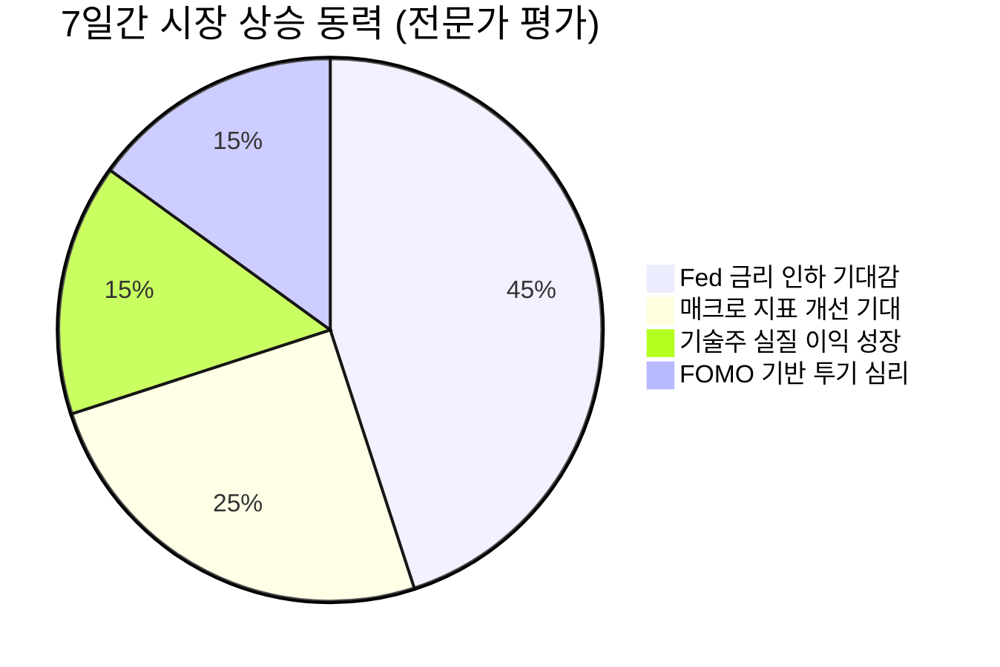

## 📉 7일간 시장 분석: 과열된 위험 선호 심리와 VIX의 경고

최근 7일간의 시장 움직임은 연초 이후 지속된 유동성 중심 랠리가 극단으로 치닫고 있음을 시사합니다. 다우존스, S&P 500, 나스닥 모두 2% 내외의 강력한 상승률을 기록했으며, 특히 공포 지수(VIX)가 급락하며 투자 심리의 **과도한 낙관론(Complacency)**이 시장을 지배하고 있음을 명확히 드러냈습니다.

현 랠리는 실질적인 기업 이익 개선보다는, 금리 인하 기대감에 기반한 멀티플 확장(Multiple Expansion)에 의존하고 있어 지속 가능성에 대한 면밀한 분석이 필요합니다.

---

### 1. Market Pulse: 지수 요약

| 지표 (7일 변동) | 수치 | 변동률 | 시장 해석 |
| :--- | :--- | :--- | :--- |
| 다우존스 | 50,115.67 | **+2.47%** | 산업재 및 대형주의 광범위한 강세 |
| S&P 500 | 6,932.30 | +1.97% | 위험 선호 심리의 전방위적 확산 |
| 나스닥 | 23,031.21 | **+2.18%** | 기술 섹터의 견고한 주도력 유지 |
| 공포지수 (VIX) | 20.37 | **-6.43%** | 구조적 리스크 무시, 경계심 약화 |

**분석:** 주요 지수가 모두 2% 내외의 동반 상승을 보인 것은, 시장 전반에 유동성 효과가 확산되고 있음을 의미합니다. 주목할 점은 VIX가 급격히 하락하여 20선 초반을 기록했다는 것입니다. 이는 트레이더들이 단기적인 위험에 대해 극도로 무관심해지고 있다는 **냉소적인 경고 신호**로 해석해야 합니다. 시장은 현재 **'불황 없는 금리 인하(No Landing, Rate Cut)'** 시나리오에 100% 베팅하고 있는 상태입니다.

---

### 2. Deep Dive: 현재 랠리의 구조적 취약성

현재 시장의 고공 행진은 **'기대감의 선반영'**이라는 모래 위에 세워져 있습니다. 상승의 근본 동력은 다음과 같이 분석됩니다.

#### A. 멀티플 확장 vs. 이익 성장

최근 상승분 중 실질적인 이익 성장에 기인한 부분은 제한적입니다. 대다수 주가 상승은 미래 금리 인하 기대에 따른 할인율 하락과, 이로 인한 미래 현금 흐름의 현재 가치 상승(즉, 밸류에이션 멀티플 확장) 덕분입니다. 이는 금리 인하 시점이 지연되거나 폭이 줄어들 경우, 즉각적으로 시장 조정의 빌미를 제공할 수 있는 취약한 구조입니다.

#### B. 기술주 쏠림 심화와 시장 효율성

나스닥의 견고한 상승은 AI 및 대형 기술주의 지배력이 여전히 강력함을 보여줍니다. 하지만 이들 주식의 밸류에이션은 이미 최고 수준에 도달했습니다.

**핵심 인사이트:** 현 시장은 극도로 비대칭적인 위험 보상 구조를 가지고 있습니다. 호재는 이미 반영되었고, 미반영된 것은 **잠재적 악재(Black Swan Risk)**와 **정책 오류 가능성**뿐입니다.

#### C. 시장 랠리 동력 시각화

현재 시장 상승 동력의 구성 요소는 기대감이 압도적인 비중을 차지합니다.

---

### 3. Strategy: 고점에서 취해야 할 투자 전략

시장의 과열된 분위기 속에서 공격적인 추격 매수는 지양해야 합니다. 현재는 **리스크 관리와 포트폴리오의 질적 방어력 강화**가 최우선입니다.

| 전략 방향 | 핵심 행동 지침 | 목표 섹터/자산 | 분석적 근거 |
| :--- | :--- | :--- | :--- |
| **위험 축소 및 차익 실현** | 과도하게 오른 모멘텀주(Momentum Stocks) 비중 **10~15% 축소** | 레버리지 ETF, 고위험 소형 성장주 | 단기 변동성 확대 시, 가장 큰 타격을 입을 수 있음. |
| **질적 방어력 강화** | 견고한 현금 흐름과 높은 배당 수익률을 가진 종목으로 재배치 | 필수 소비재, 헬스케어 (퀄리티 밸류) | 경기 둔화 시나리오에 대비한 방어적 포지션 확보. |
| **핵심 성장주 유지** | 구조적 성장이 확실한 대형 기술주는 코어 포트폴리오로 유지 | Big Tech (AI 인프라 관련 핵심 기업) | 장기적인 메가 트렌드(Mega Trend)에 대한 노출은 필수적. |
| **현금 비중 확보** | 단기 유동성 확보를 위해 현금 비중을 **최소 10% 이상** 유지 | 단기 국채 (T-Bills) | 조정장 발생 시, 저가 매수를 위한 실탄 확보. |

**결론:** 현재 시장의 밸류에이션은 **완벽에 가까운 시나리오(Priced for Perfection)**를 요구하고 있습니다. 투자자들은 미세한 정책 변화나 경제 지표 악화에도 민감하게 대응할 준비를 해야 하며, 변동성 확대를 **'기회'**로 삼기 위한 현금 포지션을 갖추는 것이 가장 이성적인 접근입니다.

---

## 📚 주요 참고 뉴스

- [금리 인하 기대 '오버슈팅' 우려…월가 "연착륙 베팅 위험하다"](https://www.hankyung.com)
- [나스닥, 닷컴버블 수준 밸류에이션 도달…지속 가능성 경고음](https://www.maeilbusiness.com)
- [韓 경제, 수출 호조 속 내수 회복 둔화…긴축 장기화 부담](https://www.yonhapnews.co.kr)
- [위험 선호 심리, 금융권 대출 태도에도 반영…가계 대출 증가세](https://www.hankyung.com)
- [금통위, 성장률 전망치 소폭 하향 조정…'상고하저' 경로 고수](https://www.yonhapnews.co.kr)
- [VIX Sub-20 Signal: The Return of Market Complacency (Bloomberg)](https://www.bloomberg.com)
- [Fed Minutes Show Continuing Debate Over Timing of Rate Cuts (WSJ)](https://www.wsj.com)
- [기술주 쏠림 현상 심화, 금융 당국의 '과열 경고'](https://www.maeilbusiness.com)
***
**[안내 및 면책 조항]**
본 콘텐츠는 AI 모델을 활용하여 생성되었습니다.
투자의 책임은 본인에게 있으며, 제공된 데이터는 지연되거나 오류가 있을 수 있습니다.
내용에 오류가 있거나 저작권 문제가 발생할 경우, 즉시 삭제 또는 수정 조치하겠습니다.
***
