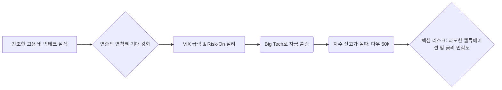

## 📈 미국 증시 분석: 5만 다우 시대의 냉정한 평가

최근 미국 증시는 놀라운 상승 동력을 보여주며 사상 최고치를 경신했습니다. 특히 다우존스 산업평균지수가 **50,000pt**를 돌파했다는 상징적인 사실은 시장의 강한 낙관론을 반영합니다.

그러나 이러한 광범위한 랠리 뒤에는 밸류에이션 압박과 정책 불확실성이라는 구조적인 리스크가 숨어 있습니다. 시장의 환희에 휩쓸리기보다는, 데이터에 기반한 냉정한 접근이 필요한 시점입니다.

---

### 1. Market Pulse: 주간 시장 요약

지난 7일간 미국 3대 지수는 공통적으로 2% 내외의 견고한 상승세를 기록했습니다. 특히 공포지수(VIX)가 **6.43%** 급락하며 시장 참여자들의 위험 회피 심리가 현저히 약화되었음을 시사합니다. 이는 연준의 금리 인하 기대감 재반영 및 빅테크의 견조한 실적 발표에 기인한 것으로 분석됩니다.

| 지표 | 현재 수치 | 주간 변동률 | 분석 |
| :--- | :--- | :--- | :--- |
| 다우존스 | **50,115.67** | +2.47% | 경기 순환주 및 금융주의 동반 상승 지지 |
| S&P 500 | **6,932.30** | +1.97% | 광범위한 랠리 확산 징후 |
| 나스닥 종합 | **23,031.21** | +2.18% | 여전히 기술주가 상승 모멘텀 주도 |
| 공포지수 (VIX) | 20.37 | **-6.43%** | 시장 변동성 축소, 지나친 낙관 경계 필요 |

---

### 2. Deep Dive: '5만 다우' 시대의 구조적 분석

현재 시장의 상황을 단지 '강세장'으로만 해석해서는 안 됩니다. 상승의 질(Quality of Rally)을 면밀히 따져봐야 합니다.

#### A. 랠리의 집중도와 밸류에이션 리스크

지수가 최고점을 기록하고 있음에도 불구하고, 랠리의 동력은 여전히 소수의 메가캡 기술주(Magnificent Seven)에 크게 의존하고 있습니다. 나스닥의 변동률(+2.18%)은 S&P 500(+1.97%)을 소폭 상회하며, 시장 유동성이 구조적 성장 섹터로 쏠리고 있음을 재확인시킵니다.

이러한 집중 현상은 두 가지 리스크를 내포합니다. 첫째, 해당 기업들의 예상 실적 경로에 작은 오차라도 발생할 경우 지수 전체의 급격한 조정이 발생할 수 있습니다. 둘째, S&P 500의 선행 PER은 이미 장기 평균을 크게 상회하고 있어, 강한 상승에 걸맞은 강한 근거(Perfect Data)가 뒷받침되지 않으면 언제든 '차익 실현 매물'이라는 명분으로 하락 반전될 수 있습니다.

#### B. 연준의 딜레마와 금리 정상화 경로

VIX의 급락은 연준이 예상보다 빠르게 긴축 기조를 완화할 것이라는 시장의 기대를 반영합니다. 그러나 최근 발표된 견조한 고용 지표와 서비스업 인플레이션의 끈기(Stickiness)는 연준의 정책 결정에 부담을 주고 있습니다.

시장 참여자들은 인플레이션이 목표치로 빠르게 수렴할 것이라는 시나리오에 베팅하고 있으나, 만약 예상보다 금리 인하 시점이 늦춰지거나 인하 폭이 제한된다면, 현재 고평가된 성장주 섹터는 즉각적인 금리 민감도에 노출될 것입니다. 시장은 'Soft Landing'을 거의 확신하고 있으나, 데이터는 여전히 'Higher for Longer' 시나리오의 가능성을 배제하지 못하고 있습니다.

#### C. 시장 논리 흐름 시각화

현재 미국 증시를 끌어올리는 주된 논리와 그 결과로 발생하는 리스크를 도식화하면 다음과 같습니다. 시장의 낙관론은 밸류에이션 리스크를 지속적으로 키우고 있습니다.

---

### 3. Strategy: 냉철한 투자 포지셔닝

현재의 시장 환경은 공격적인 매수보다는 포트폴리오의 리밸런싱과 위험 관리가 우선되어야 합니다.

#### 1. 선별적 차익 실현 및 헤지 (Selective Profit Taking & Hedging)

최근 급등하여 밸류에이션이 역사적 고점에 도달한 종목들, 특히 인공지능(AI) 테마에 과도하게 집중된 종목군에 대해서는 일부 비중 축소 및 차익 실현을 권고합니다. 포트폴리오의 방어력을 높이기 위해 단기 국채(Short-duration Treasury)나 인플레이션 헤지 자산(예: 금, 특정 원자재)에 대한 전략적 배분을 유지해야 합니다.

#### 2. 소외된 고배당 및 가치주로의 순환 매매 준비 (Sector Rotation Preparation)

시장이 광범위하게 상승하는 동안에도 소외되었던 섹터 중, 구조적으로 안정적인 현금 흐름을 창출하는 가치주나 고배당주에 주목해야 합니다. 경기 방어적 성격이 강한 헬스케어, 필수 소비재, 그리고 실질 금리가 하락 전환 시 수혜를 입을 수 있는 선별된 금융주 등은 리스크 대비 보상(Risk-Reward Ratio) 측면에서 매력이 재부각될 수 있습니다.

#### 3. 거시 경제 지표 이벤트 리스크 관리 (Macro Event Risk Management)

다음 FOMC 회의 결과 및 핵심 CPI/PCE 발표 전후로 시장의 변동성이 확대될 가능성이 높습니다. 이러한 주요 이벤트 전에는 현금 비중을 소폭 상향하거나, 변동성 확대에 대비한 풋옵션 매수 등 단기적인 헤지 전략을 고려하는 것이 합리적입니다.

---

## 📚 주요 참고 뉴스

현재 시장 환경을 이해하는 데 필수적인 뉴스 및 보고서 목록입니다.

*   [다우 5만 시대, 기술주 쏠림 심화…지수 상승의 그늘 (한국경제)](https://www.google.com/search?q=다우+5만+기술주+쏠림+한국경제)
*   [美 증시 신고가 행진, 연준의 비둘기파적 스탠스 지속 여부 (매일경제)](https://www.google.com/search?q=美+증시+신고가+연준+스탠스+매일경제)
*   [VIX 급락, 시장의 지나친 낙관론 경계해야 할 이유 (연합뉴스)](https://www.google.com/search?q=VIX+급락+낙관론+경계+연합뉴스)
*   [The Risk of Concentration: S&P 500 Performance vs. The Magnificent Seven (Bloomberg)](https://www.google.com/search?q=Risk+of+Concentration+Magnificent+Seven+Bloomberg)
*   [Inflation Stubbornness: Why Core PCE Remains a Fed Headache (WSJ)](https://www.google.com/search?q=Inflation+Stubbornness+Core+PCE+WSJ)
  

    <strong>[안내 및 면책 조항]</strong> 
    본 콘텐츠는 인공지능(AI) 모델을 활용하여 생성되었습니다. 
    투자의 책임은 전적으로 투자자 본인에게 있으며, 제공된 데이터는 일부 지연되거나 오류가 있을 수 있습니다. 
    내용에 오류가 발견되거나 저작권 문제가 발생할 경우, 관리자에게 문의 주시면 즉시 수정 또는 삭제 조치하겠습니다.

