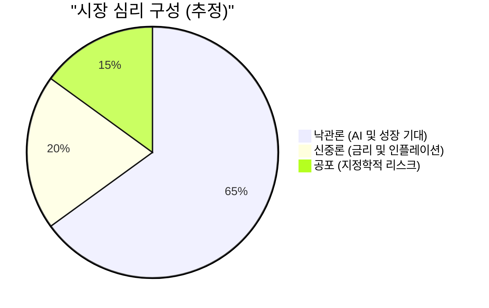

## Market Pulse: 축제의 끝은 어디인가?

뉴욕 증시는 마치 중력의 법칙을 잊은 듯한 상승세를 이어가고 있습니다. 다우 지수가 **50,000**이라는 역사적 이정표를 넘어선 것은 단순한 수치를 넘어 시장의 광기가 어디까지 닿아 있는지를 보여주는 단면입니다. 

| 지수명 | 현재가 | 주간 등락률 | 비고 |
| :--- | :---: | :---: | :--- |
| **다우존스 (DJI)** | **50,115.67** | **+2.47%** | 사상 최고치 경신, 심리적 저항선 돌파 |
| **S&P500** | **6,932.30** | **+1.97%** | 7,000 고지 가시권 진입 |
| **나스닥 (NASDAQ)** | **23,031.21** | **+2.18%** | 기술주 중심의 공격적 매수세 지속 |
| **공포지수 (VIX)** | **20.37** | **-6.43%** | 시장의 안도감 확산, 변동성 축소 |

**[분석가 코멘트]**
현재 시장은 '나만 뒤처질 수 없다'는 **FOMO(Fear Of Missing Out)** 증후군에 완전히 잠식되었습니다. 변동성 지수(VIX)가 6% 이상 하락하며 20포인트 초반에 머물고 있다는 점은, 투자자들이 잠재적인 거시경제적 리스크를 애써 외면하고 있다는 증거이기도 합니다.

---

## Deep Dive: 펀더멘털인가, 유동성의 환각인가?

다우 지수 5만 포인트 시대는 지표상으로는 화려하지만, 그 이면을 들여다보면 냉소적인 시각을 유지할 필요가 있습니다.

1.  **실적 기대치와 밸류에이션의 괴리**: 기업들의 이익 성장세가 뒷받침되고는 있으나, 현재의 주가 수익비율(PER)은 역사적 평균치를 훨씬 상회하고 있습니다. 이는 미래의 성장을 현재로 과도하게 끌어다 쓰고 있다는 신호입니다.
2.  **공포지수의 하락이 주는 경고**: VIX가 **20.37**까지 내려왔다는 것은 시장이 극도로 낙관적이라는 뜻입니다. 역설적으로 하락에 대한 대비가 전혀 되어 있지 않은 상태에서 발생하는 '블랙 스완'은 시장에 치명적인 타격을 줄 수 있습니다.
3.  **지수별 편중 현상**: 나스닥이 **2.18%** 상승하며 지수를 견인하고 있지만, 상승 종목의 폭이 좁아지는 '슬림화 현상'이 관찰됩니다. 이는 소수의 빅테크 기업들이 시장 전체의 착시 현상을 일으키고 있음을 시사합니다.

---

## Strategy: 취하되, 문 근처에서 마셔라

지금의 상승 랠리에서 소외될 필요는 없으나, 취기가 머리끝까지 오르기 전에 퇴로를 확인해야 합니다.

*   **포트폴리오 리밸런싱**: 수익이 크게 난 기술주 비중을 일부 축소하고, 상대적으로 저평가된 방어주나 배당 성장주로의 수익 실현 매물을 이동시키는 전략이 유효합니다.
*   **현금 비중 확보**: 지수가 신고가를 경신할 때마다 일정 수준(예: 전체 자산의 10~15%)의 현금을 확보하여 갑작스러운 조정에 대비하십시오.
*   **추격 매수 금지**: **S&P500 7,000**이라는 숫자에 매몰되어 고점에서 비중을 늘리는 우를 범해서는 안 됩니다. 현재는 '보유자의 영역'이지 '신규 진입자의 적기'는 아닙니다.

---

## 📚 주요 참고 뉴스

- [WSJ - Markets Section](https://www.wsj.com/market-data)
- [Bloomberg - Markets News](https://www.bloomberg.com/markets)
- [한경 글로벌마켓 - 미국 증시 리포트](https://www.hankyung.com/globalmarket)
- [매일경제 - 해외 증시 뉴스](https://www.mk.co.kr/news/world)
- [연합인포맥스 - 뉴욕 증시 현황](https://news.einfomax.co.kr)

### 🏷️ 태그
#미국증시 #다우5만 #S&P500 #나스닥 #투자전략
  

    <strong>[안내 및 면책 조항]</strong> 
    본 콘텐츠는 인공지능(AI) 모델을 활용하여 생성되었습니다. 
    투자의 책임은 전적으로 투자자 본인에게 있으며, 제공된 데이터는 일부 지연되거나 오류가 있을 수 있습니다. 
    내용에 오류가 발견되거나 저작권 문제가 발생할 경우, 관리자에게 문의 주시면 즉시 수정 또는 삭제 조치하겠습니다.

