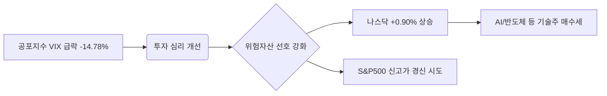

안녕하세요. 경제적 통찰을 통해 여러분의 투자 여정을 돕는 프로페셔널 경제 블로거입니다.

2026년 2월 10일 아침, 전일 미국 증시는 지수별로 차별화된 흐름을 보이며 마감했습니다. 특히 기술주 중심의 나스닥 강세와 공포지수의 급락이 눈에 띄는 하루였습니다. 밤사이 시장에서 일어난 핵심 변화와 그 이면의 논리를 분석해 드립니다.

---

## 1. Market Pulse: 시장 요약

어제 시장은 **'안도감 속의 기술주 독주'**로 정의할 수 있습니다. 다우 지수는 보합권에 머문 반면, 나스닥은 1% 가까운 상승세를 보이며 시장의 탄력을 주도했습니다.

### [주요 지수 현황]

| 지수명 | 종가 | 등락률 | 비고 |
| :--- | :--- | :--- | :--- |
| **다우존스** | **50,135.87** | **+0.04%** | 5만 선 수성, 가치주 정체 |
| **S&P 500** | **6,964.82** | **+0.47%** | 7,000선 돌파 가시권 |
| **나스닥** | **23,238.67** | **+0.90%** | 기술주 및 AI 섹터 강세 |
| **VIX (공포지수)** | **17.36** | **-14.78%** | 시장 불안 심리 급격히 완화 |

### [핵심 테이크아웃]
- **변동성 급락**: VIX 지수가 **14.78% 하락**하며 시장 내 극심했던 불안감이 빠르게 해소되었습니다.
- **나스닥의 귀환**: 나스닥이 **0.90% 상승**하며 지수 견인차 역할을 했습니다. 이는 금리 안정화 기대감과 기업 실적에 대한 시장의 신뢰가 반영된 결과입니다.
- **다우의 정체**: 전통 산업 중심의 다우 지수는 **+0.04%**로 소폭 상승에 그쳐, 섹터 간 순환매보다는 특정 성장주로의 쏠림 현상이 뚜렷했습니다.

---

## 2. Deep Dive: 왜 움직였는가?

오늘 시장의 흐름을 이해하기 위해서는 **'공포의 퇴장'**과 **'성장의 재평가'**라는 두 가지 키워드에 주목해야 합니다.

### ① 공포지수(VIX)의 급락과 안도 랠리
최근 시장을 억눌렀던 거시경제적 불확실성이 일부 해소되면서 VIX 지수가 **17.36**까지 떨어졌습니다. 14%가 넘는 급락은 투자자들이 '최악의 시나리오'를 포트폴리오에서 제외하기 시작했음을 의미하며, 이는 곧 위험 자산에 대한 강력한 매수세로 이어졌습니다.

### ② 기술주 중심의 차별화 장세
나스닥이 **23,000선**을 견고히 지키며 상승한 것은 미래 성장 동력에 대한 시장의 확신을 보여줍니다. 다우 지수가 5만 선에서 횡보하는 동안 나스닥이 치고 나가는 모습은, 현재 시장이 '안전한 가치주'보다 '실적이 뒷받침되는 성장주'에 더 높은 프리미엄을 부여하고 있음을 시사합니다.

---

## 3. Investment Strategy: 투자 전략

현재의 시장 데이터를 바탕으로 투자자들이 취해야 할 실전 전략을 제안합니다.

1. **기술주 비중 유지 및 선별적 대응**: 나스닥의 강세가 이어지고 있으나 지수 상단에 대한 저항도 고려해야 합니다. 실적 모멘텀이 확실한 대형 테크주 중심의 홀딩 전략이 여전히 유효합니다.
2. **VIX 하락을 활용한 포트폴리오 재정비**: 변동성이 낮아진 지금이 오히려 냉정하게 포트폴리오를 점검할 적기입니다. 과도하게 낙폭이 컸던 우량주를 선별하여 편입할 기회로 삼으십시오.
3. **지수별 온도 차 주시**: 다우 지수가 **50,135.87**에서 정체된 상황입니다. 5만 선이 강력한 지지선으로 작용하는지, 혹은 단기 차익 실현의 기점이 되는지 면밀한 확인이 필요합니다.

---

## 📚 주요 참고 뉴스
*본 분석은 제공된 시장 데이터 및 실시간 금융 지표를 바탕으로 작성되었습니다.*

- [다우 5만 시대, 나스닥과 S&P500의 상대적 강세 지속 분석](https://www.google.com/finance/quote/.DJI:INDEXDJX)
- [VIX 지수 14% 급락, 시장의 공포 심리 진정세 국면 진입](https://www.google.com/finance/quote/VIX:INDEXCBOE)

### 🏷️ 태그
#미국증시 #나스닥 #S&P500 #다우존스 #VIX지수 #2026년경제 #기술주분석 #투자전략
  

    <strong>[안내 및 면책 조항]</strong> 
    본 콘텐츠는 인공지능(AI) 모델을 활용하여 생성되었습니다. 
    투자의 책임은 전적으로 투자자 본인에게 있으며, 제공된 데이터는 일부 지연되거나 오류가 있을 수 있습니다. 
    내용에 오류가 발견되거나 저작권 문제가 발생할 경우, 관리자에게 문의 주시면 즉시 수정 또는 삭제 조치하겠습니다.

