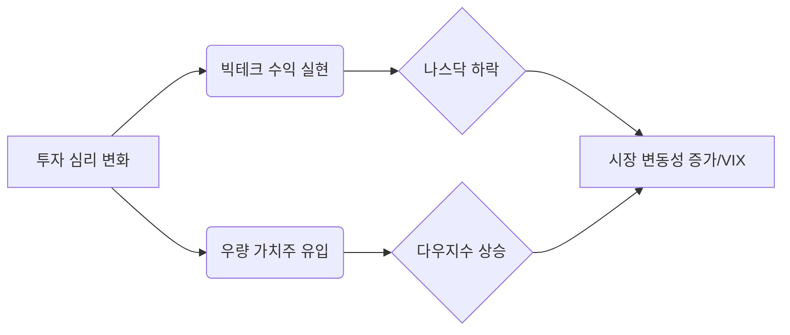

안녕하세요. 경제적 통찰을 통해 여러분의 투자 길잡이가 되어드리는 전문 경제 블로거입니다.

2026년 2월 11일 오전, 밤사이 마감된 미국 증시와 전일 시장의 흐름을 분석해 드립니다. 현재 시장은 **다우 지수 5만 포인트 안착**이라는 역사적 상징성과 **기술주 중심의 차익 실현**이라는 두 흐름이 팽팽하게 맞서고 있습니다.

---

## 1. Market Pulse: 시장 요약

어제와 밤사이 글로벌 시장은 지수별로 희비가 엇갈리는 '혼조세'를 보였습니다. 주요 지표를 통해 시장의 온도를 먼저 확인하시죠.

### 📋 주요 지수 현황
| 지수명 | 종가 | 등락률 | 비고 |
| :--- | :---: | :---: | :--- |
| **다우존스 (DJI)** | **50,188.14** | **+0.10%** | 5만 포인트 선 수성, 가치주 강세 |
| **S&P 500** | **6,941.81** | **-0.33%** | 대형주 중심의 하락 전환 |
| **나스닥 (NASDAQ)** | **23,102.47** | **-0.59%** | 기술주 및 반도체 섹터 약세 |
| **공포지수 (VIX)** | **17.79** | **+2.48%** | 시장 불확실성 증가에 따른 반등 |

### 💡 핵심 요약 (Key Takeaways)
1. **다우 5만 시대의 개막**: 다우 지수가 50,000 포인트를 상회하며 역사적인 구간에 진입했습니다. 이는 경기 민감주와 금융주에 대한 신뢰를 보여줍니다.
2. **기술주의 단기 조정**: 나스닥은 0.59% 하락하며 고점 부담감을 드러냈습니다. 금리 경로에 대한 불확실성이 기술주 성장에 제동을 거는 모습입니다.
3. **심상치 않은 VIX 지수**: 공포지수가 2.48% 상승하며 시장 참여자들의 경계심이 높아지고 있음을 시사합니다.

---

## 2. Deep Dive: 왜 움직였는가?

### 🔄 섹터 간 '순환매'와 가치의 재발견
현재 시장의 가장 큰 특징은 **기술주에서 가치주로의 자금 이동**입니다. 나스닥이 조정을 받는 와중에도 다우 지수가 상승세를 유지한 것은 투자자들이 이미 많이 오른 AI 및 빅테크 종목에서 수익을 실현하고, 상대적으로 저평가된 우량주(Blue-chip)로 이동하고 있음을 의미합니다.

### 📈 공포지수(VIX) 상승의 배경
VIX 지수가 17.79까지 상승한 것은 단순한 하락 이상의 의미를 갖습니다. 다우 5만 포인트라는 고점 달성 이후, 향후 경제 지표 발표를 앞두고 '뉴스에 팔자'는 심리가 작용하고 있습니다. 특히 인플레이션 둔화 속도가 예상보다 더딜 수 있다는 우려가 시장에 스며들고 있습니다.

### 📊 시장 흐름 시각화 (Mermaid Chart)

---

## 3. Investment Strategy: 대응 전략

변동성이 커지는 시점일수록 냉철한 판단이 필요합니다. 현재 데이터가 가리키는 전략적 방향은 다음과 같습니다.

1. **포트폴리오 리밸런싱**: 나스닥 비중이 지나치게 높다면, 현재의 조정 국면을 활용해 **배당 성장주나 경기 방어주**로 일부 비중을 분산할 필요가 있습니다.
2. **현금 비중 확보**: VIX 지수가 반등하고 있는 만큼, 예상치 못한 추가 조정에 대비해 **10~15% 수준의 현금**을 보유하여 저가 매수 기회를 노리는 것이 현명합니다.
3. **지수 하단 지지선 확인**: S&P 500의 경우 6,900선, 나스닥의 경우 23,000선이 강력한 지지선으로 작용하는지 면밀히 관찰해야 합니다.

---

## 📚 주요 실시간 데이터 및 분석
*본 분석은 아래의 시장 지표 및 실시간 데이터를 근거로 작성되었습니다.*
- [다우존스 산업평균지수 차트 및 상세 분석](https://finance.yahoo.com/quote/%5EDJI)
- [S&P 500 지수 실시간 변동성 및 구성 종목](https://finance.yahoo.com/quote/%5EGSPC)
- [나스닥 종합지수 기술적 지표 현황](https://finance.yahoo.com/quote/%5EIXIC)
- [CBOE VIX(공포지수) 변동 추이](https://finance.yahoo.com/quote/%5EVIX)

---

### 🏷️ 태그
#미국증시 #다우5만 #나스닥조정 #VIX지수 #재테크전략 #가치주순환매 #주식시황 #글로벌경제
  

    <strong>[안내 및 면책 조항]</strong> 
    본 콘텐츠는 인공지능(AI) 모델을 활용하여 생성되었습니다. 
    투자의 책임은 전적으로 투자자 본인에게 있으며, 제공된 데이터는 일부 지연되거나 오류가 있을 수 있습니다. 
    내용에 오류가 발견되거나 저작권 문제가 발생할 경우, 관리자에게 문의 주시면 즉시 수정 또는 삭제 조치하겠습니다.

