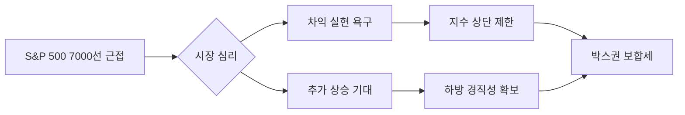

안녕하세요. 시장의 미세한 흐름을 포착하여 최적의 투자 전략을 제시하는 전문 경제 블로거입니다.

2026년 2월 12일, 간밤의 미국 증시는 주요 지수가 역사적 신고가 부근에서 상승세를 멈추며 강력한 **'심리적 저항선'**을 확인했습니다. 특히 S&P 500 지수가 7,000포인트라는 기념비적인 수치를 앞두고 숨 고르기에 들어간 모습입니다. 어제의 시장 흐름 분석과 함께 우리가 주목해야 할 핵심 포인트를 정리해 드립니다.

---

## 1. Market Pulse: 시장 요약

어제 미국 증시는 전반적으로 **보합권 내 혼조세**로 마감했습니다. 시장을 끌어내릴 만한 악재는 없었으나, 지수가 역사적 고점에 도달했다는 경계심이 강해지며 매수세가 일시적으로 위축되었습니다.

| 지수명 | 종가 | 등락률 | 상태 |
| :--- | :--- | :--- | :--- |
| **다우존스** | 50,121.40 | -0.13% | 🔻 소폭 하락 |
| **S&P 500** | 6,941.47 | -0.00% | ➖ 보합 유지 |
| **나스닥** | 23,066.47 | -0.16% | 🔻 소폭 하락 |
| **공포지수(VIX)** | 17.65 | -0.79% | 📉 안정세 |

### 💡 주요 관전 포인트
- **S&P 500의 7,000선 터치 실패**: 장중 6,950선 근방까지 접근했으나, 7,000이라는 상징적인 '마디 지수'를 앞두고 차익 실현 매물이 출현하며 상승폭을 반납했습니다.
- **VIX 지수 하락**: 지수는 소폭 조정받았으나 변동성 지수(VIX)가 함께 낮아진 것은, 현재 시장에 공포보다는 향후 방향성을 탐색하려는 '관망세'가 짙음을 시사합니다.

---

## 2. Deep Dive: 왜 시장은 멈춰 섰는가?

현재 시장의 움직임은 추세의 반전이라기보다 고점 부담에 따른 **'속도 조절'**로 풀이됩니다. 세 가지 주요 원인을 분석합니다.

### ① 역사적 고점의 무게감
다우 50,000 시대 진입 이후 S&P 500마저 7,000을 목전에 두고 있습니다. 투자자들은 추가 상승에 대한 기대감과 동시에 "밸류에이션 과열"에 대한 의구심을 동시에 느끼고 있습니다. 이러한 심리적 충돌이 거래량 감소와 보합세로 나타나고 있습니다.

### ② 방향성 탐색 중인 매크로 지표
최근 발표된 고용 및 물가 데이터가 견조하게 유지되면서, 추가 금리 인하에 대한 기대와 인플레이션 재점화 우려가 팽팽하게 맞서고 있습니다. 시장을 한 단계 더 점프시킬 강력한 매크로 트리거가 필요한 시점입니다.

### ③ 섹터별 순환매 가속화
그동안 지수를 견인했던 빅테크 중심의 나스닥은 다소 힘이 빠진 모습이나, 지수의 하방이 견고한 것은 자금이 다른 소외 섹터로 원활하게 순환되고 있음을 의미합니다.

---

## 3. Investment Strategy: 개인 투자자 대응 전략

지수가 고점에서 횡보할 때는 무리한 추격 매수보다는 **포트폴리오의 내실을 다지는 전략**이 유효합니다.

1. **'7,000 돌파 및 안착' 확인**: S&P 500이 7,000선을 강력한 거래량과 함께 돌파하는지 확인 후 비중을 조절하십시오. 돌파 성공 시 새로운 강세장이 열리겠지만, 실패 시 단기 조정 폭이 깊어질 수 있습니다.
2. **퀄리티 주식(Quality Stocks) 비중 유지**: 변동성 장세에서도 견고한 현금 흐름을 창출하는 대형 우량주 위주로 포트폴리오를 재편하십시오. VIX가 낮은 수준인 만큼 급락 가능성은 낮으나, 방어적인 태도는 항상 필요합니다.
3. **현금 비중 10~15% 확보**: 역사적 고점 부근에서는 일정 수준의 현금을 보유하여, 향후 발생할 수 있는 눌림목(Dip) 기회에서 우량주를 저가 매수할 실탄을 마련해 두는 것이 현명합니다.

---

## 📚 주요 참고 자료
- [Yahoo Finance: S&P 500 Index Overview](https://finance.yahoo.com/quote/%5EGSPC)
- [CBOE: VIX Volatility Index Real-time Data](https://www.cboe.com/tradable_products/vix/)
- [Bloomberg: Markets Today & Economic Calendar](https://www.bloomberg.com/markets)

---

### 🏷️ 태그
#미국증시 #SP500 #나스닥 #다우존스 #투자전략 #2026년증시 #재테크 #경제분석 #주식시장 #해외주식
  

    <strong>[안내 및 면책 조항]</strong> 
    본 콘텐츠는 인공지능(AI) 모델을 활용하여 생성되었습니다. 
    투자의 책임은 전적으로 투자자 본인에게 있으며, 제공된 데이터는 일부 지연되거나 오류가 있을 수 있습니다. 
    내용에 오류가 발견되거나 저작권 문제가 발생할 경우, 관리자에게 문의 주시면 즉시 수정 또는 삭제 조치하겠습니다.

