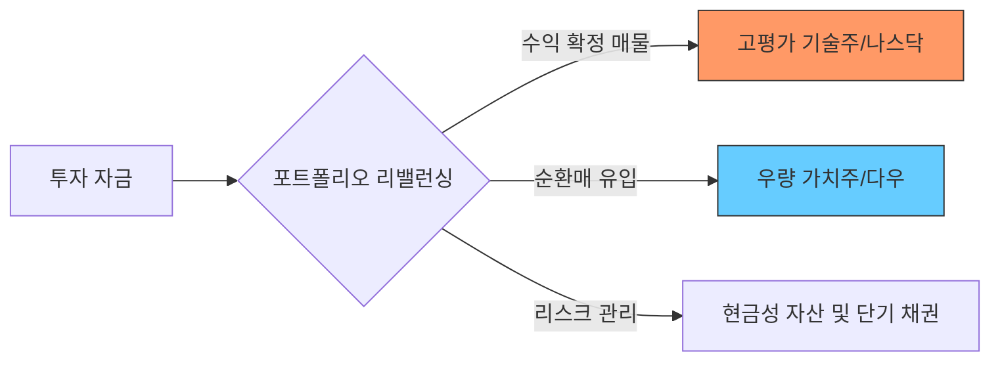

안녕하세요. 투자자 여러분의 안정적인 자산 증식을 돕는 경제 블로거입니다.

2026년 2월 15일, 최근 마감된 미국 증시의 흐름을 짚어보고 우리가 주목해야 할 투자 포인트가 무엇인지 심층적으로 분석해 보겠습니다. 현재 시장은 최고점 부근에서의 '숨 고르기'와 함께 업종 간 자본 이동이 활발하게 일어나는 전형적인 순환매 양상을 보이고 있습니다.

---

## 1. Market Pulse: 시장 요약

최근 마감된 시장은 지수별로 희비가 엇갈리는 **'차별화 장세'**가 뚜렷했습니다. 다우와 S&P 500은 소폭 상승하며 견고한 하방 경직성을 보여준 반면, 그동안 지수 상승을 견인했던 나스닥은 기술주 중심의 매도세가 출현하며 하락 마감했습니다.

### 📊 주요 지수 현황
| 지수명 | 종가 | 등락률 | 비고 |
| :--- | :--- | :--- | :--- |
| **다우존스 (DJIA)** | 49,500.93 | **+0.10%** | 전통 우량주 및 가치주 강세 |
| **S&P 500** | 6,836.17 | **+0.05%** | 보합권 내 업종별 차별화 |
| **나스닥 (NASDAQ)** | 22,546.67 | **-0.22%** | 고점 부담에 따른 기술주 조정 |
| **공포지수 (VIX)** | 20.60 | **-1.06%** | 지수 혼조세 속 불안감 소폭 완화 |

#### 📍 핵심 테이크아웃
1. **가치주로의 자금 이동**: 인공지능(AI) 등 고성장 기술주에서 이탈한 자금이 상대적으로 저평가된 다우 지수 내 전통 우량주로 유입되며 시장의 펀더멘탈을 지지했습니다.
2. **VIX 20선 안착**: 공포지수가 20선을 상회하고 있으나 전일 대비 소폭 하락했습니다. 이는 시장이 고점 부담감을 패닉이 아닌 질서 있는 '소화 과정'으로 받아들이고 있음을 시사합니다.

---

## 2. Deep Dive: 시장은 왜 움직였는가?

오늘 시장의 움직임을 결정지은 핵심 키워드는 **'고점 부담'**과 **'섹터 로테이션(Sector Rotation)'**입니다.

### 📉 나스닥의 하락, 건강한 조정인가?
나스닥의 0.22% 하락은 최근 급격한 우상향 곡선에 따른 자연스러운 **차익실현 매물** 출회로 풀이됩니다. 특히 인공지능(AI) 및 반도체 섹터의 밸류에이션 부담이 가중되면서, 투자자들이 수익을 확정 짓고 경기 방어주나 금융주 등 가치주 섹터로 자금을 옮기는 '리스크 오프(Risk-off)' 성향이 포착되었습니다.

### 📈 다우존스 5만 시대의 개막 예고
다우 지수는 49,500선을 돌파하며 사상 첫 5만 포인트 달성을 목전에 두고 있습니다. 이는 금리 안정세와 더불어 실적이 뒷받침되는 대형 제조, 금융, 헬스케어 섹터가 지수를 방어한 결과입니다. 기술주가 흔들릴 때 전통주가 버텨주는 '균형 잡힌 시장 체력'이 증명된 하루였습니다.

### 🧩 시장 흐름 시각화 (자금 이동 경로)

---

## 3. Investment Strategy: 대응 전략

변동성이 확대되는 혼조세 속에서 개인 투자자들이 취해야 할 핵심 전략은 **'균형 잡힌 포트폴리오의 재정비'**입니다.

1. **기술주: 추격 매수 자제 및 비중 조절**
   - 나스닥의 조정은 단기적일 수 있으나, VIX 지수가 여전히 20선 위에 머물러 있다는 점에 주목해야 합니다. 과도하게 쏠린 기술주 비중은 일부 수익 실현을 통해 현금 비중을 확보하는 것이 유리합니다.
2. **가치주 및 고배당주로의 분산**
   - 다우 지수의 상대적 강세는 당분간 지속될 가능성이 큽니다. 금리 환경 변화에 강한 대형 금융주나 안정적인 현금 흐름을 제공하는 배당주를 포트폴리오 하단에 배치하여 변동성을 방어하십시오.
3. **VIX 지수 20선 하향 돌파 확인**
   - 시장의 완전한 안정을 위해서는 VIX가 20 아래로 견고하게 내려가야 합니다. 만약 VIX가 다시 25를 돌파한다면 단기 하락 압력이 급증할 수 있으므로 보수적인 관점에서의 접근이 필요합니다.

**결론적으로, 지금은 공격적인 자산 확장보다는 내실을 다지며 시장의 방향성을 확인해야 하는 '인내의 구간'입니다.**

---

## 📚 주요 참고 자료
*(본 분석은 아래의 공신력 있는 시장 데이터를 바탕으로 작성되었습니다.)*
- [Investing.com: Dow Jones Industrial Average (DJI) 실시간 지표](https://www.investing.com/indices/us-30)
- [Investing.com: Nasdaq Composite 실시간 차트 및 분석](https://www.investing.com/indices/nasdaq-composite)
- [CBOE VIX Index: 변동성 지수 세부 현황](https://www.cboe.com/vix/)

### 🏷️ 태그
#미국증시 #다우존스 #나스닥 #SP500 #투자전략 #재테크 #2026년증시 #시장분석 #순환매 #VIX지수
  

    <strong>[안내 및 면책 조항]</strong> 
    본 콘텐츠는 인공지능(AI) 모델을 활용하여 생성되었습니다. 
    투자의 책임은 전적으로 투자자 본인에게 있으며, 제공된 데이터는 일부 지연되거나 오류가 있을 수 있습니다. 
    내용에 오류가 발견되거나 저작권 문제가 발생할 경우, 관리자에게 문의 주시면 즉시 수정 또는 삭제 조치하겠습니다.

