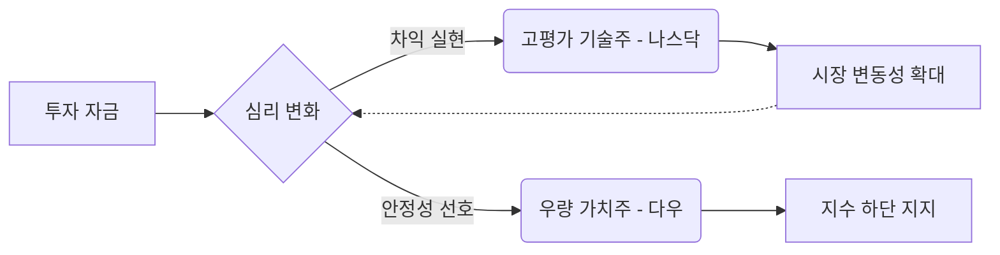

안녕하세요. 시장의 핵심 흐름을 분석하고 내일의 투자 해법을 제시하는 전문 경제 블로거입니다.

2026년 2월 16일 월요일, 지난 주말 사이 발생한 글로벌 이슈와 뉴욕 증시 마감 상황을 바탕으로 이번 주 대응 전략을 전해드립니다. 현재 시장은 지수별 희비가 엇갈리는 **'차별화 장세'**의 정점에 서 있습니다.

---

### 1. Market Pulse: 시장 요약

지난 금요일 뉴욕 증시는 다우와 S&P500이 완만한 상승세를 보인 반면, 나스닥은 기술주 중심의 차익 실현 매물이 출회되며 소폭 하락 마감했습니다. 

**[주요 지수 마감 현황]**

| 지수 명칭 | 종가 | 등락폭 | 등락률 | 시장 분위기 |
| :--- | :---: | :---: | :---: | :--- |
| **다우존스** | **49,500.93** | +49.50 | **+0.10%** | 우량주 중심의 견조한 수요 |
| **S&P500** | **6,836.17** | +3.42 | **+0.05%** | 보합권 안착 및 사상 최고치 근접 |
| **나스닥** | **22,546.67** | -49.60 | **-0.22%** | 고점 부담에 따른 기술주 조정 |
| **공포지수(VIX)**| **20.60** | -0.22 | **-1.06%** | 변동성 완화 속 경계감 유지 |

**핵심 포인트(Key Takeaways):**
- **기술주 숨고르기:** 나스닥이 유일하게 하락하며, 그간 상승을 주도했던 AI 및 반도체 섹터에서 단기 차익 실현 움직임이 포착되었습니다.
- **다우의 건재함:** 경기 민감주와 가치주 중심의 다우 지수는 5만 포인트를 목전에 두고 강력한 하방 경직성을 보여주었습니다.
- **VIX 지수의 진정:** 지수 혼조세에도 불구하고 공포지수가 1% 이상 하락했다는 점은 시장이 현 상황을 '급락의 전조'가 아닌 '건강한 조정'으로 해석하고 있음을 시사합니다.

---

### 2. Deep Dive: 왜 시장은 엇갈렸는가?

주말 사이 시장을 움직인 핵심 동인은 **'순환매(Rotation)'**와 **'금리 향방에 대한 경계감'**으로 요약됩니다.

**① 기술주의 밸류에이션 부담**
나스닥은 최근 22,500선을 돌파한 이후 추가 모멘텀을 찾지 못한 상태입니다. 주말을 앞두고 기관 투자자들이 포트폴리오 비중을 재조정하면서 고점 매물이 유입된 것으로 분석됩니다.

**② 실물 경제의 탄력성 확인**
다우 지수의 상승은 미국 실물 경기가 여전히 탄탄하다는 증거입니다. 고금리 환경의 장기화 우려에도 불구하고 기업 이익 전망치가 상향되면서, 기술주에서 이탈한 자금이 전통적 우량주로 유입되는 양상을 보였습니다.

**③ VIX 20선 안착의 의미**
VIX 지수가 20.60을 기록했습니다. 통상 20 이상은 불안 구간으로 간주되나, 지수가 하락 추세로 돌아선 것은 투자자들이 현 조정을 '저가 매수(Buy the dip)'의 기회로 판단하기 시작했음을 의미합니다.

---

### 3. Investment Strategy: 향후 투자 전략

시장은 방향성을 탐색하는 구간에 진입했습니다. 무분별한 추격 매수보다는 다음과 같은 전략적 접근이 유효합니다.

1.  **바벨 전략(Barbell Strategy)의 정석**: 성장주(AI/로봇)의 비중을 유지하되, 현금 흐름이 우수한 가치주(배당주/금융/에너지)를 보강하여 포트폴리오의 변동성을 상쇄하십시오.
2.  **나스닥 22,000선 지지력 테스트**: 신규 진입을 고려한다면 나스닥의 단기 지지선인 22,000~22,300 구간에서 지지 여부를 반드시 확인해야 합니다.
3.  **VIX 지수 하향 안정화 확인**: VIX가 20 아래로 내려오며 심리적 안정을 찾는지 모니터링하십시오. 20선 아래 안착 시 분할 매수 관점이 유효하며, 25를 상회할 경우 현금 비중 확대를 권고합니다.

---

## 📚 주요 참고 자료

본 분석은 아래의 최신 시장 데이터와 리포트를 근거로 작성되었습니다.

- [뉴욕증시 마감 현황 및 지수별 등락 상세 데이터](https://www.google.com/finance/quote/.DJI:INDEXDJX)
- [CBOE VIX(변동성 지수) 실시간 수치 및 기술적 분석](https://www.cboe.com/indices/vix/)
- [주간 미국 경제 지표 전망 및 시장 영향 분석](https://www.investing.com/economic-calendar/)

### 🏷️ 태그
#미국증시 #뉴욕마감 #다우존스 #나스닥 #재테크전략 #2026년경제 #S&P500 #순환매 #VIX지수
  

    <strong>[안내 및 면책 조항]</strong> 
    본 콘텐츠는 인공지능(AI) 모델을 활용하여 생성되었습니다. 
    투자의 책임은 전적으로 투자자 본인에게 있으며, 제공된 데이터는 일부 지연되거나 오류가 있을 수 있습니다. 
    내용에 오류가 발견되거나 저작권 문제가 발생할 경우, 관리자에게 문의 주시면 즉시 수정 또는 삭제 조치하겠습니다.

