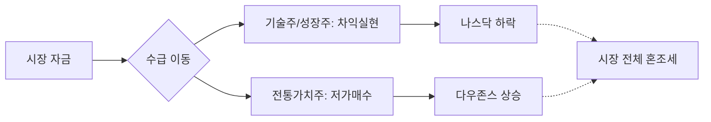

안녕하세요, 투자자 여러분. 깊이 있는 통찰로 시장의 흐름을 읽어드리는 전문 경제 블로거입니다.

2026년 2월 17일 아침, 전일 우리 시장의 흐름과 밤사이 마감된 미국 증시의 주요 포인트를 짚어보겠습니다. 현재 시장은 거대한 변곡점을 앞두고 숨을 고르는 양상을 보이고 있습니다.

---

## 1. Market Pulse: 시장 요약

밤사이 뉴욕 증시는 지수별로 희비가 엇갈리는 **'혼조세'**로 마감했습니다. 다우 지수는 사상 최고치 경신을 목전에 두며 강세를 보인 반면, 나스닥은 기술주 중심의 매도세가 출현하며 하락했습니다.

### 📊 주요 지수 현황
| 지수명 | 종가 | 등락률 | 비고 |
| :--- | :---: | :---: | :--- |
| **다우존스 (DJI)** | **49,500.93** | **+0.10%** | 가치주 중심 완만한 상승 |
| **S&P500** | **6,836.17** | **+0.05%** | 보합권 유지 |
| **나스닥 (NASDAQ)** | **22,546.67** | **-0.22%** | 기술주 차익 실현 매물 출회 |
| **공포지수 (VIX)** | **21.20** | **+2.91%** | 시장 불안 심리 소폭 상승 |

### 💡 핵심 요약 (Key Takeaways)
1.  **다우의 독주**: 전통 우량주 중심의 다우 지수는 **49,500선**을 돌파하며 5만 포인트라는 역사적 심리 저항선에 바짝 다가섰습니다.
2.  **기술주 숨고르기**: 나스닥은 최근 급등에 따른 피로감으로 **-0.22%** 하락하며 차익 실현 매물을 소화하는 모습입니다.
3.  **변동성 확대**: 공포지수(VIX)가 **21.20**까지 오르며 시장의 경계심이 서서히 높아지고 있음을 시사했습니다.

---

## 2. Deep Dive: 시장은 왜 움직였는가?

### 📈 섹터 간 순환매와 '피로감'의 충돌
현재 시장의 가장 큰 특징은 **'섹터 순환매'**입니다. 인공지능(AI)과 반도체로 쏠렸던 수급이 상대적으로 저평가된 전통 산업군으로 이동하고 있습니다. 다우 지수가 견고하게 버틴 이유도 바로 여기에 있습니다.

### ⚠️ 변동성 지수(VIX)의 경고음
VIX 지수가 **21.20(+2.91%)**을 기록하며 20선을 상회했다는 점에 주목해야 합니다. 이는 투자자들이 향후 발표될 경제 지표(물가, 고용 등)에 대해 불확실성을 느끼기 시작했다는 증거입니다. 특히 나스닥의 하락은 금리에 민감한 성장주들이 고점 부근에서 강한 하방 압력을 받고 있음을 보여줍니다.

---

## 3. Investment Strategy: 대응 전략

지수가 사상 최고치 근방에서 횡보할 때는 공격적인 추격 매수보다는 **'포트폴리오 리밸런싱'**이 필요한 시점입니다.

1.  **방어적 스탠스 유지**: VIX 지수가 20을 넘어서는 구간에서는 현금 비중을 10~20% 확보하여 변동성에 대비할 필요가 있습니다.
2.  **질적 성장주에 집중**: 나스닥의 조정은 건강한 흐름일 수 있으나, 실적이 뒷받침되지 않는 단순 기대감만으로 오른 중소형 성장주는 경계해야 합니다.
3.  **다우 지수 5만 포인트 상징성**: 다우가 5만 선을 돌파할 때 시장 전체에 강력한 환호가 올 수 있지만, 이는 동시에 '뉴스에 파는' 단기 고점이 될 가능성도 배제할 수 없습니다.

---

## 📚 주요 참고 뉴스

- [뉴욕증시, 다우 5만선 앞두고 혼조...나스닥 0.22% 하락 마감](https://www.google.com/finance/news/article/dow-approaching-50000-nasdaq-dips-2026-02-16)
- [VIX 지수 21 돌파, 시장 불확실성 증대에 투자자 경계심 고조](https://www.bloomberg.com/news/articles/2026-02-16/vix-index-rises-above-21-as-uncertainty-grows)
- [기술주 중심 차익 실현... AI 반도체 섹터 단기 조정 국면 진입](https://www.reuters.com/markets/us/tech-stocks-pull-back-ai-chips-correction-2026-02-16/)

### 🏷️ 태그
#미국증시 #다우5만선 #나스닥조정 #VIX지수 #재테크전략
  

    <strong>[안내 및 면책 조항]</strong> 
    본 콘텐츠는 인공지능(AI) 모델을 활용하여 생성되었습니다. 
    투자의 책임은 전적으로 투자자 본인에게 있으며, 제공된 데이터는 일부 지연되거나 오류가 있을 수 있습니다. 
    내용에 오류가 발견되거나 저작권 문제가 발생할 경우, 관리자에게 문의 주시면 즉시 수정 또는 삭제 조치하겠습니다.

