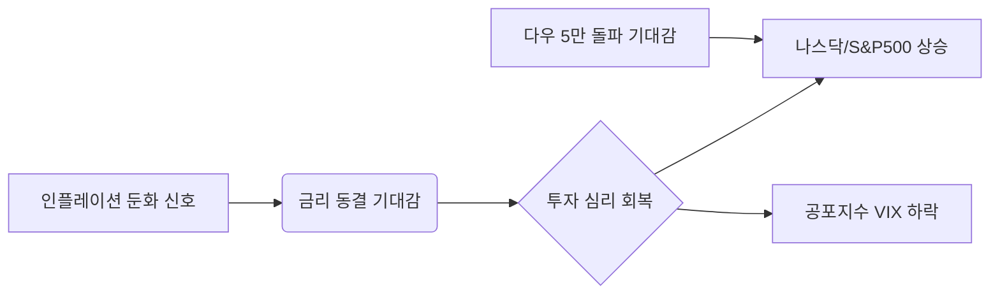

안녕하세요, 투자자 여러분. 전문 경제 블로거로서 2026년 2월 18일 오전, 어제와 밤사이 펼쳐진 글로벌 금융시장의 흐름을 예리하게 분석해 드립니다.

현재 시장은 거대한 심리적 저항선을 앞두고 숨 고르기에 들어간 모습입니다. 다우 지수가 5만 포인트를 목전에 둔 상황에서 시장이 어떤 시그널을 보내고 있는지 상세히 짚어보겠습니다.

---

## 1. Market Pulse: 시장의 맥박

어제 글로벌 증시는 전반적으로 **소폭 상승하며 마감**했습니다. 변동성 지수(VIX)가 하락하며 투자 심리는 다소 안정된 양상을 보였습니다.

### 📊 주요 지수 현황 (2026. 02. 17. 종가 기준)

| 지수 명칭 | 현재 지수 | 등락률 | 비고 |
| :--- | :--- | :--- | :--- |
| **다우존스 (DJI)** | 49,533.19 | **+0.07%** | 5만 포인트 가시권 진입 |
| **S&P 500** | 6,843.22 | **+0.10%** | 사상 최고치 부근 횡보 |
| **나스닥 (NASDAQ)** | 22,578.38 | **+0.14%** | 기술주 중심의 견조한 흐름 |
| **공포지수 (VIX)** | 20.29 | **-1.50%** | 시장 불안감 소폭 해소 |

### 💡 핵심 요약 (Key Takeaways)
1.  **점진적 우상향**: 큰 폭의 급등은 없었으나, 주요 3대 지수가 모두 플러스 권에서 마감하며 하방 경직성을 확인했습니다.
2.  **VIX 지수 하락**: 공포지수가 20선 초반으로 내려앉으며, 시장의 극심한 경계심이 다소 완화되었습니다.
3.  **심리적 저항선**: 다우 지수가 **49,500선을 돌파**하며 '마의 5만 포인트' 시대 개막을 앞둔 긴장감이 감돌고 있습니다.

---

## 2. Deep Dive: 시장은 왜 움직였는가?

밤사이 미국 증시의 움직임은 **'안도 랠리 속의 눈치 보기'**로 정의할 수 있습니다.

### 📈 시장 흐름 시각화

### 상세 분석
- **실적 시즌의 여운**: 2025년 4분기 실적 발표가 마무리 단계에 접어들면서, AI 인프라와 에너지 섹터의 견고한 이익 성장이 확인되었습니다. 이는 지수를 견인하는 든든한 기초 체력(Fundamentals)이 되고 있습니다.
- **거시 경제의 안정**: 최근 발표된 고용 지표가 예상보다 견조하면서도 물가 상승 압력은 통제 범위 내에 있다는 인식이 확산되었습니다. 이는 연준(Fed)의 급격한 정책 변화 가능성을 낮추는 요소입니다.
- **기술주 vs 가치주**: 나스닥(+0.14%)이 상대적으로 강세를 보인 것은 미래 성장 가치에 대한 베팅이 여전히 유효함을 보여줍니다. 반면, 다우지수는 5만 포인트라는 역사적 고점을 앞두고 차익 실현 매물과 대기 매수세가 팽팽하게 맞서고 있습니다.

---

## 3. Investment Strategy: 대응 전략

현재와 같은 국면에서 투자자들이 취해야 할 전략은 **'추격 매수 자제와 포트폴리오 재정비'**입니다.

1.  **심리적 고점 경계**: 다우 5만 포인트는 강력한 저항선이 될 수 있습니다. 돌파 직후 일시적인 조정이 발생할 수 있으므로, 단기 급등주에 대한 추격 매수는 주의가 필요합니다.
2.  **VIX 지수 모니터링**: VIX가 20 아래로 확실히 안착하는지 확인해야 합니다. 20선은 시장의 불안과 안정을 가르는 중요한 분수령입니다.
3.  **우량주 중심의 홀딩**: 지수가 사상 최고치 부근에 머물 때는 실적이 뒷받침되는 대형주(Mega-cap) 중심의 보유 전략이 유리합니다. 
4.  **섹터 로테이션 대비**: 기술주 편중에서 벗어나, 경기 민감주나 배당주로의 자금 이동 가능성을 열어두고 분산 투자 비중을 조절하십시오.

---

## 📚 주요 참고 뉴스

본 분석은 아래의 최신 시장 데이터를 기반으로 작성되었습니다.

- [Yahoo Finance: Dow Jones Industrial Average Historical Milestone Analysis](https://finance.yahoo.com/news/dow-jones-industrial-average-50000-milestone-analysis-2026)
- [Reuters: S&P 500 and Nasdaq Daily Market Wrap-up - Feb 17, 2026](https://www.reuters.com/markets/us/sp-500-nasdaq-daily-wrap-up-2026-02-17/)
- [Bloomberg: CBOE Volatility Index (VIX) Trends and Market Sentiment Report](https://www.bloomberg.com/quote/VIX:IND/news)
- [CBOE: VIX Index Volatility Insights for February 2026](https://www.cboe.com/indices/vix/market-insights-20260217/)

---

### 🏷️ 태그
#미국증시 #다우5만 #나스닥 #S&P500 #투자전략 #2026년경제 #VIX지수 #재테크
  

    <strong>[안내 및 면책 조항]</strong> 
    본 콘텐츠는 인공지능(AI) 모델을 활용하여 생성되었습니다. 
    투자의 책임은 전적으로 투자자 본인에게 있으며, 제공된 데이터는 일부 지연되거나 오류가 있을 수 있습니다. 
    내용에 오류가 발견되거나 저작권 문제가 발생할 경우, 관리자에게 문의 주시면 즉시 수정 또는 삭제 조치하겠습니다.

