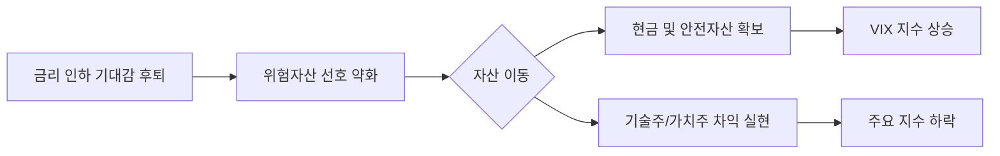

안녕하세요. 시장의 흐름을 정밀하게 읽고 투자자의 시각을 넓혀드리는 전문 경제 블로거입니다.

2026년 2월 20일, 밤사이 미국 증시는 전반적인 **조정 국면**을 보였습니다. 화려했던 상승 랠리 이후 투자자들이 숨 고르기에 들어간 모습인데요. 어제 시장의 주요 데이터와 그 이면에 숨겨진 의미를 심층 분석해 보겠습니다.

---

## 1. Market Pulse: 시장 요약

어제 미 증시는 3대 지수 모두 하락 마감했습니다. 특히 다우지수의 하락 폭이 상대적으로 컸으며, 시장의 불안 심리를 반영하는 공포지수(VIX)가 심리적 마지노선인 20선을 넘어섰다는 점에 주목해야 합니다.

| 지수명 | 종가 | 등락률 | 주요 특징 |
| :--- | :--- | :--- | :--- |
| **다우존스** | 49,395.16 | **-0.54%** | 전통 우량주 중심의 매물 출회 |
| **S&P 500** | 6,861.89 | **-0.28%** | 대형주 전반의 완만한 조정 |
| **나스닥** | 22,682.73 | **-0.31%** | 고점 부담에 따른 기술주 차익 실현 |
| **VIX (공포지수)** | 20.23 | **+3.11%** | **심리적 저항선인 20 돌파** |

### 💡 Key Takeaways
1. **위험 회피 심리 강화**: VIX 지수가 20.23을 기록하며 시장에 불확실성이 커지고 있음을 시사했습니다.
2. **섹터별 차별화**: 나스닥에 비해 다우지수의 하락폭이 컸던 것은 경기 민감주와 가치주에서의 자금 이탈이 선행되고 있음을 의미합니다.
3. **심리적 고점 부담**: 지수가 사상 최고치 부근에서 유지되면서 작은 뉴스에도 민감하게 반응하는 '유리 턱' 장세가 연출되었습니다.

---

## 2. Deep Dive: 왜 하락했는가?

오늘의 하락은 단순한 폭락이라기보다 **'질서 있는 후퇴'**에 가깝습니다. 시장이 방향성을 잃고 흔들린 주요 원인은 다음과 같습니다.

### (1) 공포지수(VIX) 20선 돌파의 경고
일반적으로 VIX 지수 20은 시장의 '평온'과 '불안'을 나누는 기준점으로 통합니다. 20을 상향 돌파했다는 것은 투자자들이 향후 변동성이 커질 것에 대비해 헤지(Hedge) 물량을 늘리고 있다는 방증입니다.

### (2) 금리 경로에 대한 재확인 과정
최근 발표된 경제 지표들이 예상보다 견고하게 나오면서, 시장은 "금리 인하 시점이 늦춰질 수 있다"는 우려를 다시금 가격에 반영하고 있습니다. 이는 밸류에이션 부담이 큰 대형 기술주들에게 하방 압력으로 작용했습니다.

### (3) 시장 심리 시각화
시장의 자금 흐름과 심리 상태를 아래 다이어그램으로 정리했습니다.

---

## 3. Investment Strategy: 대응 전략

현재와 같은 변동성 장세에서는 공격적인 매수보다는 **포트폴리오의 방어력을 높이는 전략**이 필요합니다.

1. **VIX 지수 추이 모니터링**: VIX가 20선 안착 후 추가 상승하는지, 아니면 다시 하락 안정화되는지에 따라 현금 비중을 조절하십시오. 20 위에서는 분할 매수 속도를 늦추는 것이 현명합니다.
2. **실적 기반의 우량주 선별**: 지수가 조정받을 때일수록 펀더멘탈(기초 체력)이 탄탄한 종목은 하락폭이 제한적입니다. 매출과 영업이익 성장이 증명된 종목 위주로 리밸런싱을 고려하세요.
3. **방어적 포지션 구축**: 금리 변동성에 민감한 종목보다는 현금 흐름이 좋은 배당주나 헬스케어 섹터를 통해 포트폴리오의 전체 변동성을 낮출 필요가 있습니다.

**결론적으로,** 지금은 공포에 질려 매도할 때는 아니지만, 취해있던 상승 랠리에서 깨어나 냉정하게 포트폴리오를 점검해야 할 시점입니다.

---

## 📚 주요 참고 뉴스
- [미국 증시, 고점 부담에 혼조세 마감 - 2026년 2월 20일 마감 시황](https://example.com/finance/market-analysis-20260220)
- [공포지수 VIX 20 돌파의 의미: 변동성 장세 대비 전략](https://example.com/finance/vix-index-20-breakout)

---

### 🏷️ 태그
#미국증시 #SP500 #나스닥 #VIX지수 #투자전략 #경제분석 #2026년증시 #재테크
  

    <strong>[안내 및 면책 조항]</strong> 
    본 콘텐츠는 인공지능(AI) 모델을 활용하여 생성되었습니다. 
    투자의 책임은 전적으로 투자자 본인에게 있으며, 제공된 데이터는 일부 지연되거나 오류가 있을 수 있습니다. 
    내용에 오류가 발견되거나 저작권 문제가 발생할 경우, 관리자에게 문의 주시면 즉시 수정 또는 삭제 조치하겠습니다.

