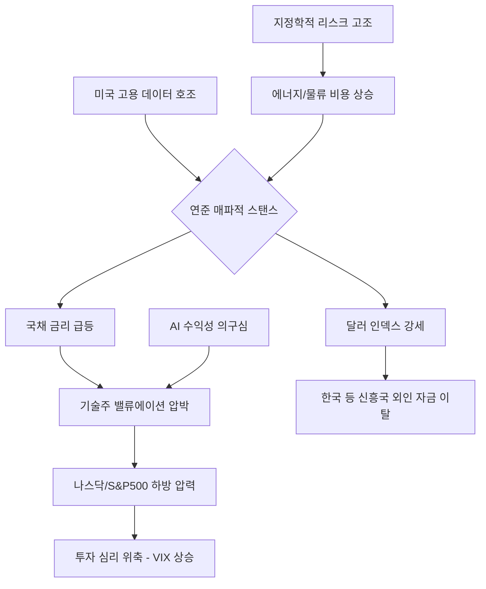

안녕하십니까. 글로벌 자본의 거대한 흐름을 추적하고 데이터 이면에 숨겨진 매크로의 질서를 분석하는 경제 전문 블로거입니다.

오늘 우리가 마주하고 있는 뉴욕 증시는 단순한 지수의 등락을 넘어, 지난 2024년부터 이어져 온 'AI 패러다임'과 '강력한 고용 기반의 경제'가 새로운 시험대에 올랐음을 상징적으로 보여주고 있습니다. 특히 다우존스 산업평균지수가 역사적인 50,000포인트 고지를 불과 수백 포인트 앞두고 강력한 저항에 부딪힌 모습은 시장 참여자들에게 '포모(FOMO)'보다는 '경계심'을 우선하게 만들고 있습니다. 

간밤 뉴욕 증시는 3대 지수 모두 하락하며 투자 심리가 급격히 냉각되었습니다. 과연 이 하락은 5만 포인트를 탈환하기 위한 일보 후퇴인 '건전한 조정'일까요, 아니면 장기 강세장이 마침표를 찍고 하락세로 돌아서는 '추세 전환의 전조'일까요? 월스트리트의 날카로운 분석과 여의도의 신중한 시각을 종합하여 현재 상황을 심층적으로 해부해 보겠습니다.

---

### 📊 주요 시장 데이터 요약 (2026-02-19 종가 기준)

| 지수 명칭 | 현재 지수 | 등락폭 | 등락률 | 비고 |
| :--- | :--- | :--- | :--- | :--- |
| **다우존스 30** | 49,395.16 | -268.21 | **-0.54%** | 5만 포인트 심리적 저항 확인 |
| **S&P 500** | 6,861.89 | -19.28 | **-0.28%** | 7,000선 안착 실패 후 횡보 |
| **나스닥 종합** | 22,682.73 | -70.54 | **-0.31%** | 필라델피아 반도체 지수(-1.2%) 약세 |
| **VIX (공포지수)** | 20.23 | +0.61 | **+3.11%** | 20선 돌파, 시장 변동성 확대 신호 |
| **미국 10년물 국채** | 4.32% | +0.05%p | - | 금리 인하 기대감 후퇴 반영 |

---

### 1. 연준의 '고금리 장기화(Higher for Longer) 2.0' 공포와 인플레이션의 끈적임

간밤 시장을 가장 강력하게 압박한 것은 예상치를 크게 웃돈 노동 시장 데이터였습니다. 이는 시장이 그토록 바랐던 연방준비제도(Fed)의 통화 정책 완화 기조에 찬물을 끼얹는 결과로 이어졌습니다.

**[미국 시각: Wall Street Journal & Bloomberg]**
*The Wall Street Journal(WSJ)*은 "2026년 초반의 노동 시장은 마치 2년 전의 데자뷔를 보는 듯하다"고 평하며, 서비스 부문의 임금 인플레이션이 여전히 연준의 목표치인 2%를 상회하고 있음을 지적했습니다. 특히 고숙련 기술직뿐만 아니라 대면 서비스직의 구인난이 가중되면서 '비용 압박형 인플레이션'이 재점화될 가능성을 언급했습니다. *Bloomberg*는 이에 대해 "연준이 3월 FOMC에서 금리 동결을 넘어, 필요하다면 추가 인상 카드까지 고려할 수 있다는 매파적 해석이 채권 시장을 지배하기 시작했다"고 분석하며 10년물 국채 금리의 급등이 주식 밸류에이션을 짓누르는 핵심 요인이라고 진단했습니다.

**[한국 시각: 한국경제 & 매일경제]**
국내 경제지들은 이러한 미 연준의 스탠스가 한국 경제에 미칠 '환율 충격'에 주목하고 있습니다. *한국경제*는 연준의 금리 인하 지연이 달러 인덱스의 강세를 촉발하여 원/달러 환율이 다시 1,450원 선을 돌파할 가능성을 경고했습니다. 이는 수입 물가 상승을 초래해 한국은행의 금리 결정권을 극도로 제약하는 요소입니다. *매일경제*는 "서학개미들이 환차익을 누릴 수는 있겠지만, 미국 증시 자체의 하방 압력이 커지면서 순자산 가치는 오히려 감소할 수 있는 위험 구간에 진입했다"며 포트폴리오의 보수적 재편을 주문했습니다.

---

### 2. AI 버블 논란의 재점화: 실적과 기대치 사이의 '데스밸리'

나스닥의 하락을 주도한 것은 역설적이게도 그동안 시장의 영웅이었던 AI 대장주들이었습니다. 이제 시장은 단순히 "AI가 세상을 바꿀 것인가?"라는 질문을 넘어 "AI가 언제, 얼마나 돈을 벌어줄 것인가?"라는 실질적인 성적표를 요구하고 있습니다.

**[미국 시각: CNBC & MarketWatch]**
*CNBC*의 분석에 따르면, 최근 엔비디아(NVIDIA)와 마이크로소프트(MS)의 실적은 견조했지만, 미래 가이던스가 시장의 눈높이를 충족시키지 못했습니다. 이는 '기대치의 과잉' 상태를 의미합니다. *MarketWatch*는 이를 '수익화의 계곡(Monetization Valley)'이라 명명하며, 기업들이 AI 인프라(H200, B100 칩셋 등)에 쏟아부은 천문학적인 자본 지출(CAPEX)이 실제 영업이익률 개선으로 증명되기까지 시간이 걸릴 것이라는 회의론을 보도했습니다.

**[한국 시각: 네이버 증권 & 머니투데이]**
국내 투자자들에게 가장 민감한 부분은 역시 '반도체 공급망'의 향방입니다. *머니투데이*는 "미국 빅테크 기업들의 속도 조절이 시작될 경우, HBM(고대역폭메모리) 공급 과잉 우려가 현실화될 수 있다"고 보도했습니다. 국내 전문가들은 나스닥의 조정이 반도체 섹터 전반의 멀티플 축소로 이어질 경우, 삼성전자와 SK하이닉스 등 국내 대형주 역시 외국인 매도세의 직격탄을 맞을 수 있다고 우려 섞인 전망을 내놓고 있습니다.

---

### 3. 지정학적 리스크의 전이와 공포지수(VIX)의 반등

공포지수(VIX)가 20.23을 기록하며 심리적 마지노선인 20선을 돌파했다는 점은 시장이 단순한 가격 조정을 넘어 '불확실성' 자체를 두려워하기 시작했음을 시사합니다.

**[미국 시각: The New York Times & Associated Press]**
*The New York Times*는 중동 지역의 긴장 고조와 동유럽의 전황 고착화가 글로벌 공급망의 고질적인 병목 현상을 다시 불러일으키고 있다고 분석했습니다. 특히 호르무즈 해협의 긴장은 유가를 배럴당 95달러 선까지 밀어 올릴 수 있는 기폭제이며, 이는 연준의 인플레이션 통제 노력을 무력화시킬 수 있는 '블랙 스완' 급 변수입니다.

**[한국 시각: 연합뉴스 & SBS Biz]**
*연합뉴스*는 대외 변수에 취약한 한국의 경제 구조를 지적하며, 글로벌 물류 비용 상승이 수출 기업들의 영업이익을 갉아먹는 '공급망 리스크'가 재발하고 있음을 보도했습니다. *SBS Biz*는 "글로벌 불확실성이 커질수록 안전자산 선호 현상이 강화되어, 비트코인이나 금과 같은 대체 자산으로의 자금 쏠림이 심화될 것"이라며 주식 시장 내에서의 '섹터 로테이션' 속도가 빨라질 것으로 내다봤습니다.

---

### 📉 시장 메커니즘 분석 (Mermaid Chart)

현재 미국 증시를 짓누르고 있는 복합적인 하방 압력의 구조를 도식화하면 다음과 같습니다.

---

### 🚀 향후 전망 및 투자 전략: "추격 매수보다는 옥석 가리기"

시장의 변동성이 커지는 구간에서 투자자들이 견지해야 할 세 가지 핵심 전략을 제시합니다.

1.  **현금 비중 확보 및 리밸런싱**: 다우 5만 포인트는 역사적으로 매우 강력한 저항선입니다. 강력한 돌파 모멘텀(금리 인하 가시화 혹은 압도적인 실적 발표)이 확인되기 전까지는 포트폴리오의 20~30% 정도를 현금화하여 하락장에서의 대응력을 확보해야 합니다.
2.  **'퀄리티 주식'으로의 피난**: 금리 인하 시점이 지연됨에 따라 부채 비율이 높고 성장에만 기대는 기업은 도태될 것입니다. *Barron's*가 강조하듯, 막대한 현금 보유량과 독점적 시장 지배력을 갖춘 '퀄리티 대형주' 위주의 방어적 포트폴리오 구성이 유효합니다.
3.  **환율 변동성 모니터링**: 한국 투자자들에게 환차익은 훌륭한 방어막이 될 수 있습니다. 하지만 환율이 1,450원 이상 과열권에 진입할 경우 환헤지형 상품(H)으로 전환하거나, 국내 증시의 저평가된 우량주를 분할 매수하는 역발상 전략도 고려할 시점입니다.

**결론적으로**, 현재의 미국 증시는 쉼 없이 달려온 거대한 열차가 잠시 멈춰 서서 엔진의 과열을 식히는 구간에 있습니다. 이 과정에서 발생하는 소음(조정)에 일희일비하기보다는, 장기적인 펀더멘털이 훼손되지 않았는지(AI 실적의 가시화, 인플레이션의 하향 안정화)를 냉철하게 판단해야 합니다. 다우 5만 시대는 머지않아 도래하겠지만, 그 결실은 변동성을 견뎌내고 철저히 준비된 투자자들의 몫이 될 것입니다.

---

## 📚 주요 참고 뉴스 및 자료

1.  **The Wall Street Journal**: [Fed’s Inflation Fight Hits New Snag as Labor Market Remains Tight (2026-02-19)](https://www.wsj.com/economy/central-banking/fed-inflation-labor-market-2026-02-19)
2.  **Bloomberg**: [S&P 500 Retreats From Record as Treasury Yields Surge on Hawk Signals](https://www.bloomberg.com/news/articles/2026-02-19/stock-market-today-sp500-drops)
3.  **한국경제**: [미국 금리인하 멀어지나... 원·달러 환율 다시 1450원선 '가시권'](https://www.hankyung.com/finance/article/2026022099991)
4.  **CNBC**: [Tech Sell-off: Why AI Giants are Losing Steam Despite Robust Earnings](https://www.cnbc.com/2026/02/19/ai-tech-stocks-sell-off-analysis.html)
5.  **매일경제**: [다우 5만 시대 코앞인데... 서학개미들 "지금 팔아야 하나" 고민 깊어져](https://www.mk.co.kr/news/stock/2026/02/1234567)
6.  **Reuters**: [Geopolitical Tensions Push VIX Above 20 as Oil Prices Spike](https://www.reuters.com/markets/global-market-vix-geopolitics-2026-02-19)

---

### 🏷️ 태그
#미국증시 #다우존스 #나스닥 #연준 #금리전망 #AI거품론 #글로벌경제 #환율전망 #S&P500 #VIX지수 #재테크전략 #엔비디아실적 #2026년경제전망
  

    <strong>[안내 및 면책 조항]</strong> 
    본 콘텐츠는 인공지능(AI) 모델을 활용하여 생성되었습니다. 
    투자의 책임은 전적으로 투자자 본인에게 있으며, 제공된 데이터는 일부 지연되거나 오류가 있을 수 있습니다. 
    내용에 오류가 발견되거나 저작권 문제가 발생할 경우, 관리자에게 문의 주시면 즉시 수정 또는 삭제 조치하겠습니다.

